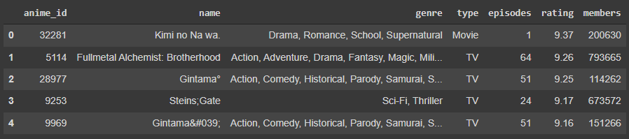
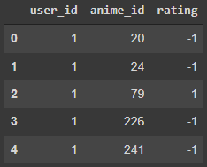
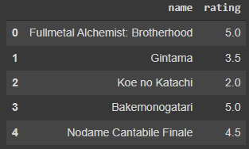
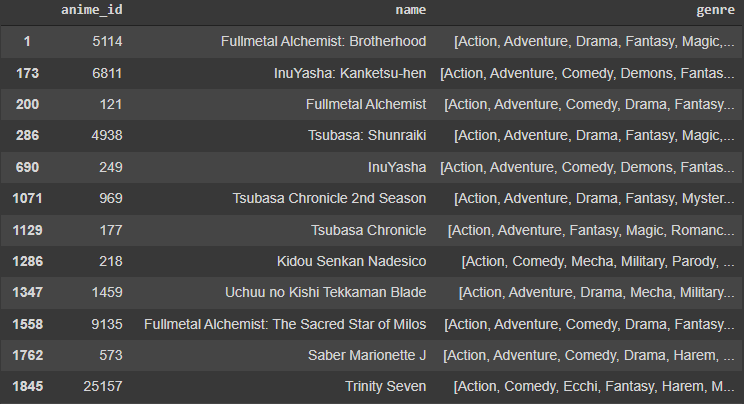
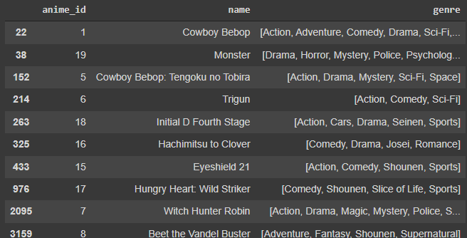

# anime-recommender-system

This is a guided-project of recommender system from 2019 Digital Talent Scholarship program. We use data from [Kaggle]( https://www.kaggle.com/datasets/CooperUnion/anime-recommendations-database?datasetId=571). The data is about 73516 user preferences in 12294 animes from myanimelist.net. The data used contain 2 files; anime.csv & rating.csv. Below, we display example data from those files. 

In this project, we built 2 kind of recommender system, namely content-based filtering and collaborative-filtering recommender system, based on user input below.

For the detail, we add genre for each anime from the user input as picture below. We can see that user likes to watch action, comedy, and drama anime. So that, we predict that the user also love to watch other animes with same genre.

## content-based filtering recommender system

A content-based filtering anime recommendation system using only anime.csv. This recommendation system provides anime recommendations for users based on their watchlists and ratings. Then, the system adjusts the genre in the overall anime list with the anime genre that the user is watching. So that users have several anime recommendations to watch according to the genre they like. This system doesn't need other users' preferences to decide recommendations for a user. Below shows Top12 anime that the system recommended for the user. We can see that system gives right choice with all the action-genre anime, and looks-like the animes also have other genres that user likes to watch.

## collaborative-filtering recommender system

A collaborative filtering anime recommendation system using anime.csv and rating.csv. This recommendation system provides anime recommendations for users not only based on their watchlists and ratings. We need other users' preferences too (in this case, the rating they give). Then, the system adjusts the rating in the overall anime list with the rating that the user gives. So that, users have several anime recommendations to watch according to similar tastes to other users. Below shows Top10 anime that the system recommended for the user. We can see that system gives right choice with the user-lovable genre anime. 

